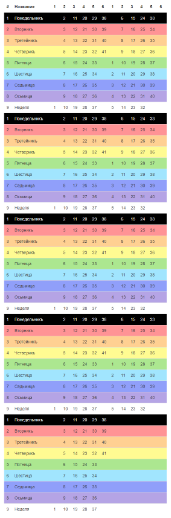
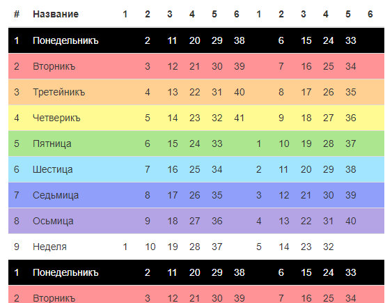

# yii2-widget-kolada-dar1

Виджет для Yii2 для рисования календаря Коляда Дар на лето

Соответствует БОСТ 000006-7528 "О задании формата даты и времени в программном коде для русского календаря" http://avr3.ru/doHmJp 

Выводит месяца в табличный календарь, визуально это выглядит так:
месяца по 41 день справа месяца по 40 дней слева, всего таких строк 5, последняя соответственно с одним месяцем




Пример одного первого блока с заголовком



## Инсталяция

Для инсталяции библиотеки используйте composer:

```json
{
    "require": {
        "i-avatar777/yii2-widget-kolada-dar1": "*"
    }
}
```

Или через команду

```
composer require i-avatar777/yii2-widget-kolada-dar1
```

## Пример использования

```
echo \avatar\widgets\KoladaDar1\KoladaDar1::widget([
    'dayStart'  => 9,
]); 
```

`dayStart` - день недели с которого начинается лето от 1 до 9

Расширенный вид запуска с параметрами стилей таблицы:

```
echo \avatar\widgets\KoladaDar1\KoladaDar1::widget([
    'dayStart'    => 9,
    'isSacral'    => true,
    'optionsWeek' => [
         1 => ['style' => 'background-color: #000000; color: #ffffff;'],
         2 => ['style' => 'background-color: #ffa6a6;'],
         3 => ['style' => 'background-color: #ffd2a6;'],
         4 => ['style' => 'background-color: #ffffa6;'],
         5 => ['style' => 'background-color: #a7fca4;'],
         6 => ['style' => 'background-color: #a6a6ff;'],
         7 => ['style' => 'background-color: #bda5d1;'],
         8 => ['style' => 'background-color: #d4a6f7;'],
         9 => ['style' => 'background-color: #ffffff;'],
     ],
    'optionsColumn' => [
        1 => ['style' => 'width: 90px;'],
        2 => ['style' => 'width: 90px;'],
        3 => ['style' => 'width: 90px;'],
        4 => ['style' => 'width: 90px;'],
        5 => ['style' => 'width: 90px;'],
        6 => ['style' => 'width: 90px;'],
     ],
    'weekDays' => [
        1 => 'Понедельникъ',
        2 => 'Вторникъ',
        3 => 'Третейникъ',
        4 => 'Четверикъ',
        5 => 'Пятница',
        6 => 'Шестица',
        7 => 'Седьмица',
        8 => 'Осьмица',
        9 => 'Неделя',
    ],
    'emptyCell'         => '&nbsp;',
    'isDrawIds'         => true,
    'isDrawDateGrigor'  => true,
    'DateGrigorFormat'  => 'd.m.Y',
    'tableOptions'      => ['class' => 'table table-hover table-striped'],
    'monthNames'        => [
        1 => '1 Рамхатъ',
        2 => '2 Айлѣтъ',
        3 => '3 Бейлѣтъ',
        4 => '4 Гэйлѣтъ',
        5 => '5 Дайлѣтъ',
        6 => '6 Элѣтъ',
        7 => '7 Вэйлѣтъ',
        8 => '8 Хейлѣтъ',
        9 => '9 Тайлѣтъ',
    ],
    'cellFormat'       => function (DateTime $d, $options) {
        $day = $options['day'];

        return $day . Html::tag('span', ' / ' . \iAvatar777\services\DateRus\DateRus::format('j K', $d->format('U')), ['style' => 'color:#ccc; font-size:70%;']);
    },
]); 
```

`optionsWeek` - массив опций для тега `tr` для каждой недели, индексы могут быть от 1 до 9

`optionsColumn` - массив опций для тега `th` для каждой колонки месяца, индексы могут быть от 1 до 6

`weekDays` - массив названий недель, индексы могут быть от 1 до 9

`isSacral` - флаг. Это священный год? Если да то все месяца будут по 41 дню

`emptyCell` - содержимое для отображения пустой ячейки дня 

`isDrawIds` - bool - флаг. Добавлять атрибут id в тег td (формат day_[m]_[d]) для дней

`isDrawDateGrigor` - bool - флаг. Добавлять подсказки к каждому дню в виде григорианской даты? true - добавлять, false - не добавлять. По умолчанию добавлять - false.

`DateGrigorFormat` - string - форматы даты для подсказки если isDrawDateGrigor = true. По умолчанию PHP date() `d.m.Y`

`DateGrigorClass` - string - Название класса для григорианской даты если $isDrawDateGrigor=true

`DateGrigorFirst` - string - Дата первого дня года в григорианском календаре в формате 'Y-m-d', по умолчанию текущий

`monthNames` - array - массив названий месяцев с индексами от 1 до 9

## Как вычислить день недели дня старта лета

В разработке.
- для 7528 лета (2019-2020) день = 9
- для 7529 лета (2020-2021) день = 5

## Ссылки

Славяно-Арийский Календарь
http://energodar.net/ha-tha.php?str=vedy%2Fkalendar 

БОСТ №000006-7528 О задании формата даты и времени в программном коде для русского календаря
https://github.com/i-avatar777/kon/blob/master/%D0%91%D0%9E%D0%A1%D0%A2/%D0%91%D0%9E%D0%A1%D0%A2000006-7528.md

Yii2
https://www.yiiframework.com/