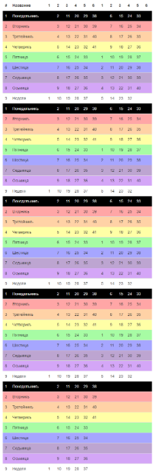
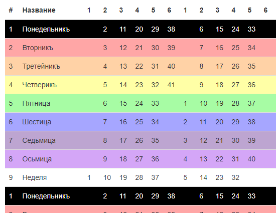

# yii2-widget-kolada-dar1

Виджет для Yii2 для рисования календаря Коляда Дар на лето

Версия 1.1.1

Выводит месяца в табличный календарь, визуально это выглядит так:
месяца по 41 день справа месяца по 40 дней слева, всего таких строк 5, последняя соответственно с одним месяцем



Пример одного первого блока с заголовком



## Пример использования

```
echo \avatar\widgets\KoladaDar1\KoladaDar1::widget([
    'dayStart'  => 9,
]); 
```

`dayStart` - день недели с которого начинается лето от 1 до 9

Расширенный вид запуска с параметрами стилей таблицы:

```
$monthArray = \avatar\widgets\KaladaDar1::getMonthArray(9, false);
echo \avatar\widgets\KaladaDar1::widget([
    'dayStart'    => 9,
    'isSacral'    => true,
    'optionsWeek' => [
         1 => ['style' => 'background-color: #000000; color: #ffffff;'],
         2 => ['style' => 'background-color: #ffa6a6;'],
         3 => ['style' => 'background-color: #ffd2a6;'],
         4 => ['style' => 'background-color: #ffffa6;'],
         5 => ['style' => 'background-color: #a7fca4;'],
         6 => ['style' => 'background-color: #a6a6ff;'],
         7 => ['style' => 'background-color: #bda5d1;'],
         8 => ['style' => 'background-color: #d4a6f7;'],
         9 => ['style' => 'background-color: #ffffff;'],
     ],
    'optionsColumn' => [
         1 => ['style' => 'width: 32px;'],
         2 => ['style' => 'width: 32px;'],
         3 => ['style' => 'width: 32px;'],
         4 => ['style' => 'width: 32px;'],
         5 => ['style' => 'width: 32px;'],
         6 => ['style' => 'width: 32px;'],
     ],
    'weekDays' => [
        1 => 'Понедельникъ',
        2 => 'Вторникъ',
        3 => 'Третейникъ',
        4 => 'Четверикъ',
        5 => 'Пятница',
        6 => 'Шестица',
        7 => 'Седьмица',
        8 => 'Осьмица',
        9 => 'Неделя',
    ],
    'emptyCell' => '&nbsp;'
]); 
```

`optionsWeek` - массив опций для тега `tr` для каждой недели, индексы могут быть от 1 до 9

`optionsColumn` - массив опций для тега `th` для каждой колонки месяца, индексы могут быть от 1 до 6

`weekDays` - массив названий недель, индексы могут быть от 1 до 9

`isSacral` - флаг. Это священный год? Если да то все месяца будут по 41 дню

`emptyCell` - содержимое для отображения пустой ячейки дня 

## Ссылки

Славяно-Арийский Календарь
http://energodar.net/ha-tha.php?str=vedy%2Fkalendar 

Yii2
https://www.yiiframework.com/